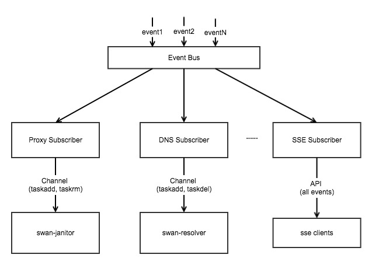

# Event功能的设计实现
Event功能是为swan与其周边组件交互而设计的。  

周边组件可以通过api与swan manager建立长连接,来监听swan的event事件

## 设计实现:
event的设计结构如图所示:



结构说明:
在swan中定义了EventBus, event bus接收events，然后再将events发送给listeners. listener可以有多个，并且可以选择监听的事件类型, 当events到达event_bus时，event_bus会循环查询listener,将此事件发送给订阅的listener.

目前swan中实现了三个listener: dns_event_suscriber, janitor_event_listener, sse_event_suscriber。

dns_event_listener: 此listener为dns服务，监听EventTypeTaskHealthy和EventTypeTaskUnhealthy事件，然后将事件信息封装成dns可以识别的类型，发送到dns监听的channel中。  

janitor_event_listener: 此listener为proxy服务，监听监听EventTypeTaskHealthy和EventTypeTaskUnhealthy事件,然后将事件封装成janitor可以识别的类型，发送到janitor监听的channel中。 

sse_event_listener: 此listener为api服务，swan对外暴露了一个sse服务: /events, listener会将所有事件通过api发送到客户端。 

## 详细设计:

+ API定义:
```
GET /events?appId=xxx
```
如果不传appId,则会接收所有的事件，如果有appId，则只会收到appId为xxx的所有app和task事件。

+ 目前支持的事件有:
```
//task_add and task_rm is used for dns/proxy service
EventTypeTaskHealthy   = "task_healthy"
EventTypeTaskUnhealthy = "task_unhealthy"

EventTypeTaskStatePendingOffer   = "task_state_pending_offer"
EventTypeTaskStatePendingKill    = "task_state_pending_killed"
EventTypeTaskStateReap           = "task_state_pending_reap"
EventTypeTaskStateStaging        = "task_state_staging"
EventTypeTaskStateStarting       = "task_state_starting"
EventTypeTaskStateRunning        = "task_state_running"
EventTypeTaskStateKilling        = "task_state_killing"
EventTypeTaskStateFinished       = "task_state_finished"
EventTypeTaskStateFailed         = "task_state_failed"
EventTypeTaskStateKilled         = "task_state_killed"
EventTypeTaskStateError          = "task_state_error"
EventTypeTaskStateLost           = "task_state_lost"
EventTypeTaskStateDropped        = "task_state_dropped"
EventTypeTaskStateUnreachable    = "task_state_unreachable"
EventTypeTaskStateGone           = "task_state_gone"
EventTypeTaskStateGoneByOperator = "task_state_gone_by_operator"
EventTypeTaskStateUnknown        = "task_state_unknown"

EventTypeAppStateCreating     = "app_state_creating"
EventTypeAppStateDeletion     = "app_state_deletion"
EventTypeAppStateNormal       = "app_state_normal"
EventTypeAppStateUpdating     = "app_state_updating"
EventTypeAppStateCancelUpdate = "app_state_cancel_update"
EventTypeAppStateScaleUp      = "app_state_scale_up"
EventTypeAppStateScaleDown    = "app_state_scale_down"
```
Task事件的信息结构为:

```
type TaskInfoEvent struct {
        Ip        string
        TaskId    string
        AppId     string
        Port      string
        State     string
        Healthy   bool
        ClusterId string
        RunAs     string
}
```

App事件的信息结构为:
```
type AppInfoEvent struct {
        AppId     string
        Name      string
        State     string
        ClusterId string
        RunAs     string
}
```

